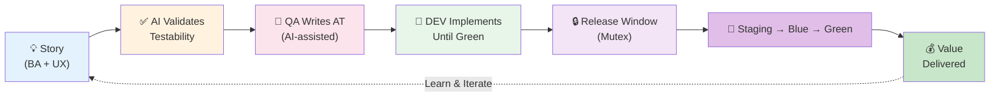

# Idea to Value Pipeline - Diagram

## Mermaid Source

```mermaid
flowchart LR
    subgraph IDEA["💡 Idea"]
        BA["BA writes Story<br/>(with UX mockups)"]
    end

    subgraph VALIDATE["✅ Validate"]
        AI_VAL["AI validates<br/>testability"]
    end

    subgraph TEST["🧪 Test First"]
        QA["QA generates AT<br/>(AI-assisted)"]
    end

    subgraph BUILD["🔨 Build"]
        DEV["DEV implements<br/>until AT passes"]
    end

    subgraph RELEASE["🚀 Release Window"]
        direction TB
        LOCK["Acquire Lock"]
        STAGE["Deploy to Staging"]
        REGRESS["Regression Suite"]
        BLUE["Deploy to Prod:Blue"]
        MANUAL["Manual Validation"]
        GREEN["Switch to Prod:Green"]
        UNLOCK["Release Lock"]
        
        LOCK --> STAGE --> REGRESS --> BLUE --> MANUAL --> GREEN --> UNLOCK
    end

    subgraph VALUE["💰 Value"]
        USERS["Users"]
        FEEDBACK["Feedback Loop"]
    end

    BA --> AI_VAL --> QA --> DEV --> LOCK
    UNLOCK --> USERS --> FEEDBACK
    FEEDBACK -.->|"Next iteration"| BA

    style IDEA fill:#e3f2fd,stroke:#1976d2
    style VALIDATE fill:#fff3e0,stroke:#f57c00
    style TEST fill:#fce4ec,stroke:#c2185b
    style BUILD fill:#e8f5e9,stroke:#388e3c
    style RELEASE fill:#f3e5f5,stroke:#7b1fa2
    style VALUE fill:#e8f5e9,stroke:#2e7d32
```



## Plain Text Description (for AI tools)

```
Idea to Value Pipeline:

1. IDEA PHASE
   - BA writes Story with UX mockups and acceptance criteria

2. VALIDATION PHASE  
   - AI validates that acceptance criteria are testable
   - Flags ambiguity before handoff to QA

3. TEST-FIRST PHASE
   - QA generates Acceptance Tests (AI-assisted)
   - Tests written against UX mockups (vapourware)
   - Tests use stable selectors from naming conventions

4. BUILD PHASE
   - DEV implements feature
   - Work continues until Acceptance Tests pass
   - No handoff needed - AT is the contract

5. RELEASE WINDOW (Mutex)
   - Story acquires pipeline lock (one at a time)
   - Deploy to Staging
   - Run full Regression Suite
   - Deploy to Prod:Blue (canary)
   - Manual validation by stakeholders
   - Switch traffic to Prod:Green
   - Release lock for next story

6. VALUE DELIVERY
   - Feature reaches users
   - Feedback collected
   - Informs next iteration

Key principle: One story at a time through the release window.
No parallel releases = no conflicts = simple rollback.
```

## Simplified Linear Version



## Tools to Polish This

1. **mermaid.live** - Paste the code, export as PNG/SVG
2. **Whimsical** - Describe the flow, it generates a cleaner visual
3. **Napkin AI** - Good for turning concepts into presentation-ready graphics
4. **Eraser.io DiagramGPT** - Technical diagram focus
