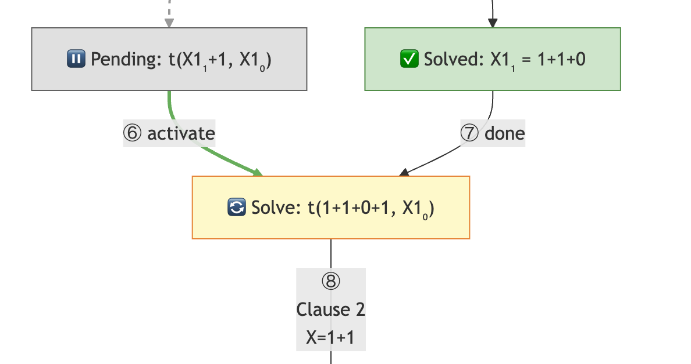
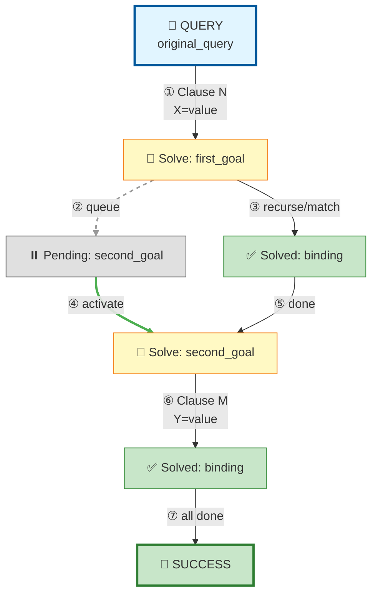

# Prolog Trace Visualization Guide

## Overview

This guide documents the process for generating enhanced Prolog execution trace visualizations using `sldnfdraw` and Mermaid diagrams.

## The Problem with Standard Tracing

Standard Prolog `trace` output and manual paper-based methods have limitations:
- Standard trace shows results after unification, not the matching process
- Paper methods break down with deep recursion and multiple subgoals
- Sequential subgoal execution is hard to visualize clearly
- Variable bindings across levels become confusing

## Solution: sldnfdraw + Enhanced Mermaid Diagrams

### Step 1: Generate Base Tree with sldnfdraw

Create a Prolog file with the sldnfdraw structure:

```prolog
:- use_module(library(sldnfdraw)).
:- sldnf.
:- set_depth(20).  % Optional: limit depth

:-begin_program.
% Your Prolog clauses here
:-end_program.

:-begin_query.
% Your query here
:-end_query.
```

Generate the tree:
```prolog
?- draw_goal("tree.tex").
```

This produces a LaTeX file with the execution tree structure.

### Step 2: Parse the LaTeX Structure

The `.tex` file contains:
- `\begin{bundle}{goal}` - A goal being solved
- `\chunk[binding]{...}` - Variable bindings and nested goals
- `\begin{tabular}{c}...\end{tabular}` - Multiple subgoals (comma-separated)
- `true` - Successful termination

Key insights from parsing:
- Goals in tabular format are **sequential subgoals** (conjunctions)
- Chunk bindings show **variable unifications**
- Nested bundles show **recursive calls**

### Step 3: Create Enhanced Mermaid Diagram

#### Core Principles

1. **Show Sequential Execution**: Make it clear that subgoals are solved left-to-right
2. **Distinguish Goal States**:
   - 🎯 Query (blue)
   - 🔄 Currently solving (yellow)
   - ⏸️ Pending/queued (gray)
   - ✅ Solved with binding (green)
   - 🎉 Final success (green)

3. **Use Three Arrow Types**:
   - **Solid arrows** (`-->`) - Active execution flow
   - **Dashed arrows** (`-.->`) - Queueing goals for later
   - **Double arrows** (`==>`) - Pending goal becomes active

4. **Number the Steps**: Use circled numbers ①②③ to show execution order

5. **Avoid Redundancy**: Don't show the same pending goal multiple times at different nesting levels

#### Mermaid Template



#### Color Scheme

- **Query**: `fill:#e1f5ff,stroke:#01579b,stroke-width:3px`
- **Solving**: `fill:#fff9c4,stroke:#f57f17`
- **Solved**: `fill:#c8e6c9,stroke:#388e3c`
- **Success**: `fill:#c8e6c9,stroke:#2e7d32,stroke-width:3px`
- **Pending**: `fill:#e0e0e0,stroke:#616161`

#### Arrow Styling

- **Dashed (queue)**: `linkStyle N stroke:#999,stroke-width:2px,stroke-dasharray:5`
- **Double (activate)**: `linkStyle N stroke:#4caf50,stroke-width:3px`

### Step 4: Add Detailed Execution Steps

Below the diagram, provide a step-by-step breakdown:

```markdown
## Execution Steps

### Step 1: Initial Query
- **Goal:** `original_query`
- **Matches:** Clause N: `clause_head :- body`
- **Binding:** `X = value`
- **New Goals:** 
  - `goal1`
  - `goal2`

### Step 2: Solve First Goal
...
```

Include:
- Which clause matched
- Variable bindings
- Remaining goals after each step

### Step 5: Add Summary

```markdown
## Final Answer
\`\`\`prolog
Variable = result
\`\`\`

## Clauses Used
1. **Clause 1:** `head :- body` - Used N times (steps X, Y, Z)
2. **Clause 2:** `head :- body` - Not used
```

## Important Details

### Variable Naming Across Levels

When the same variable name appears in recursive calls, use level-based naming:
- `X1_L1` for level 1
- `X1_L2` for level 2
- etc.

This prevents confusion when tracing deep recursion.

### Handling Pending Goals

**Key insight**: The same pending goal may appear at multiple nesting levels in the sldnfdraw output, but it's the **same goal** being carried forward.

**Rule**: Only show each unique pending goal once, at the level where it's first queued. Draw the activation arrow from that original pending node.

**Example**:
```
B creates pending goal: t(X+1, C)  → shown as B2
C still has that goal pending      → DON'T show C3 (redundant)
E activates that goal              → arrow from B2 to E
```

### Operator Associativity

Remember that `+` is left-associative:
- `1+0+1+1+1` parses as `((((1+0)+1)+1)+1)`
- When matching `X+1+1` (which is `(X+1)+1`), carefully determine what `X` binds to

### Clause Matching Labels

On arrows, show:
- Which clause matched (e.g., "Clause 2")
- Key variable bindings (e.g., "X=1+0+1")

Keep it concise but informative.

### Step Numbering and Execution Order

**Critical**: When a goal completes and a pending goal activates, the execution order is:

1. **First**: The pending goal activates (double arrow with "activate")
2. **Then**: The completion transition happens (solid arrow with "done")

**Numbering rule**: Number the "activate" arrow BEFORE the "done" arrow, following left-to-right visual order in the diagram.

**Example**:
```
C2 ==>|"⑥ activate"| E
D -->|"⑦ done"| E
```

This reflects the visual flow: the pending goal C2 activates (⑥) to become E, and the completion of D (⑦) transitions to E.

## Complete Workflow

1. **Setup**: Create `test_sldnf.pl` with program and query
2. **Generate**: Run `draw_goal("tree.tex")`
3. **Parse**: Extract goal hierarchy and bindings from LaTeX
4. **Design**: Create Mermaid diagram following principles above
5. **Document**: Add execution steps and summary
6. **Save**: Create markdown file with complete visualization

## Tools Required

- **SWI-Prolog** with `sldnfdraw` pack: `pack_install(sldnfdraw)`
- **Markdown viewer** with Mermaid support (VS Code, GitHub, etc.)

## Example Output Structure

```markdown
# Prolog Execution Tree: query

## Query
\`\`\`prolog
query_here
\`\`\`

## Search Tree Visualization
\`\`\`mermaid
graph TD
...
\`\`\`

### Legend
- 🎯 **Blue**: Initial query
- 🔄 **Yellow**: Currently solving goal
- ⏸️ **Gray**: Pending goals
- ✅ **Green**: Solved goal with binding
- 🎉 **Green**: Final success
- **Solid arrows**: Active execution flow
- **Dashed arrows**: Goals queued for later
- **Double arrows (green)**: Pending goal becomes active

## Execution Steps
...

## Final Answer
...

## Clauses Used
...
```

## Benefits of This Approach

1. **Visual clarity**: Mermaid diagrams are much clearer than LaTeX trees
2. **Sequential flow**: Numbered steps and arrow types show execution order
3. **Pending goals**: Explicitly shown and tracked to activation
4. **Scalable**: Works for complex recursive predicates
5. **Shareable**: Markdown renders anywhere (GitHub, VS Code, etc.)

## Notes

- This method is superior to manual paper tracing for complex queries
- The LaTeX output from sldnfdraw is useful for structure, but the visual rendering is poor
- Mermaid provides the best balance of clarity and ease of generation
- Always verify the trace against actual Prolog execution with `trace` command
