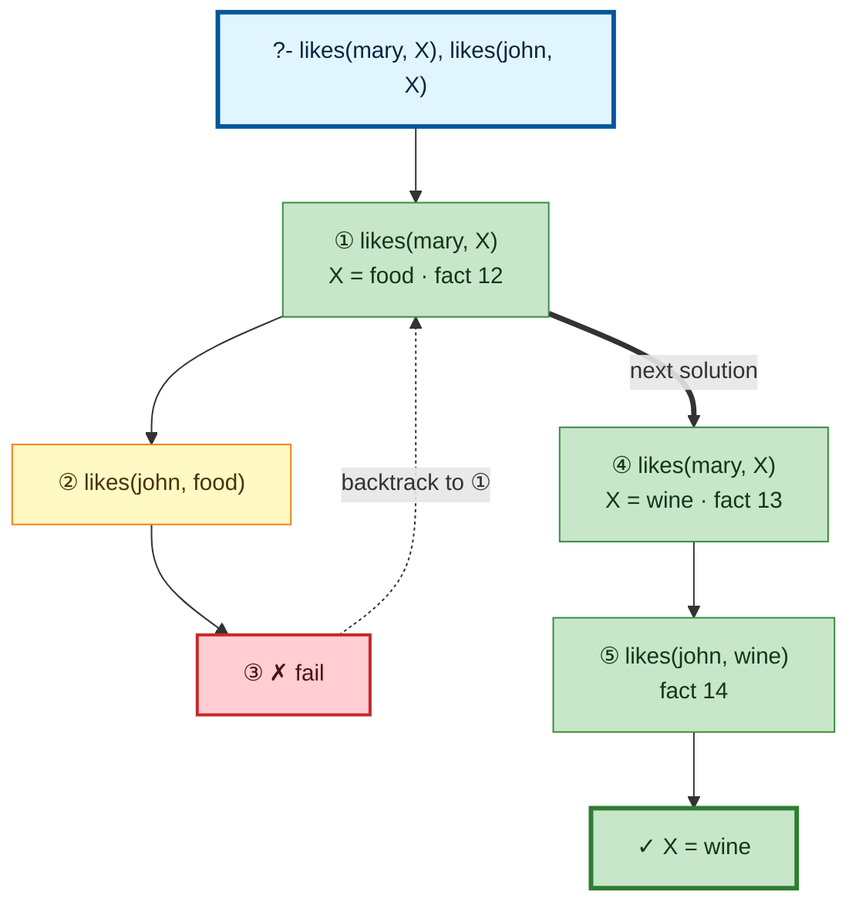

# Prolog Execution Trace: likes(mary, X), likes(john, X)

## Query

```
likes(mary, X), likes(john, X)
```

## Clause Definitions

| Line # | Clause |
|--------|--------|
| 12 | `likes(mary, food)` |
| 13 | `likes(mary, wine)` |
| 14 | `likes(john, wine)` |
| 15 | `likes(john, mary)` |

## Execution Timeline

<pre style="line-height: 1.15">
┌─ Step 1: likes(mary, X)
│  Fact: likes(mary, food) [line 12]
│  =&gt; X = food
└─

┌─ Step 2: CALL likes(john, X) → likes(john, food)
│  where X = food (from Step 1)
│  
│  ┌─ Step 3: FAIL likes(john,food)
│  │  Failure
│  └─
└─

┌─ Step 4: REDO likes(mary, X)
│  Retry of Step 1 — X = food led to failure; undone, seeking another solution
│  Fact: likes(mary, wine) [line 13]
│  =&gt; X = wine
└─

┌─ Step 5: likes(john, X) → likes(john, wine)
│  where X = wine (from Step 4)
│  Fact: likes(john, wine) [line 14]
└─

</pre>

## Call Tree



## Final Answer

```
X = wine
```

_Showing the first solution only — re-run with `-n <count>` or `--all` to see more._